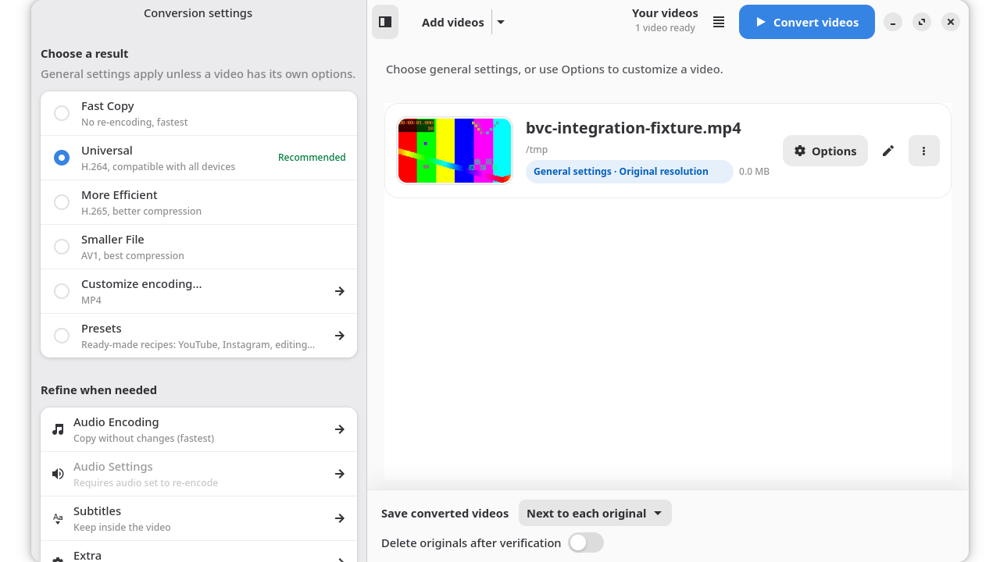

# Big Video Converter

Convert a queue of videos with FFmpeg, choose settings for each video, and preview edits before exporting.



- Apply one conversion profile to the queue or choose a preset and resolution for an individual video.
- Preview videos, trim segments, crop, rotate, mirror and adjust the image.
- Copy compatible streams or re-encode with available hardware or software encoders.
- Follow each conversion and inspect completed, failed or cancelled results.

## Install

On BigLinux, with its package repositories enabled:

```sh
sudo pacman -S big-video-converter
```

Launch **Big Video Converter** from the application menu. For other Arch-based systems, the package must be available in your configured repositories; the source recipe is in [pkgbuild/PKGBUILD](pkgbuild/PKGBUILD).

The package requires Python 3.11 or later, GTK4, libadwaita 1.5 or later, PyGObject, Cairo, FFmpeg, python-mpv, PyOpenGL, libva-utils and VTE4. Hardware encoding also depends on the GPU, its driver and the encoders included in FFmpeg. The Nautilus extension is optional.

To run a checkout with these dependencies installed:

```sh
bash tools/compile-translations.sh
./big-video-converter/usr/bin/big-video-converter-gui
```

## Use

1. Add videos or a folder, or drop files onto the queue.
2. Choose general conversion settings in the sidebar.
3. Use **Options** on a video to select its own profile or resolution. Other videos keep their general settings.
4. Use **Edit video** to preview and adjust that video.
5. Choose whether to save beside each original or in one output folder, then select **Convert videos**.

Use Tab and Shift+Tab to move between controls, Enter or Space to activate them, and Escape to dismiss dialogs. The sidebar toggle makes the conversion settings available in narrow windows.

Originals are kept by default. The optional deletion setting applies only after the converted results pass validation. Closing during active conversions asks whether to keep converting or stop; cancellation does not count as a successful conversion.

## Features

**Queue and profiles.** Each row has a video thumbnail, a settings summary and actions to play, inspect, edit or remove the video. Individual resolution choices include general, preset, original, landscape, portrait and custom dimensions. A conversion takes a snapshot of its settings when it starts, so later changes do not alter the active job.

**Editing.** Adjust brightness, contrast, saturation and hue; crop freely or to a selected aspect ratio; rotate or mirror the picture. Select time segments and export them separately or together. Editing metadata belongs to the selected video; source files remain unchanged until an explicitly requested deletion after conversion.

**Encoding and streams.** Select video codecs and quality, copy or re-encode audio, configure noise reduction and normalization, and embed or extract subtitles. Available hardware paths depend on the local FFmpeg and driver capabilities; software fallback handles supported hardware failures.

**Presets.** Bundled TOML presets target sharing, editing and archival workflows. The Presets dialog can import or duplicate profiles and prepare a prompt for an external AI assistant. User presets live in `$XDG_CONFIG_HOME/big-video-converter/presets`, or `~/.config/big-video-converter/presets` when that variable is unset. See the [bundled presets](big-video-converter/usr/share/big-video-converter/presets) for examples.

## Development

Clone the repository and install the runtime dependencies above, plus pytest, NumPy, polib, gettext, ShellCheck, Xvfb and a session D-Bus launcher for the regression suite.

```sh
git clone https://github.com/biglinux/big-video-converter.git
cd big-video-converter
bash -n big-video-converter/usr/bin/big-video-converter
shellcheck -S warning big-video-converter/usr/bin/big-video-converter
python3 -m compileall -q big-video-converter/usr/share/big-video-converter tests
xvfb-run -a dbus-run-session -- python3 -m pytest -q tests
```

Tests generate their own media. Native GTK tests require a display and accessibility bus; running without a display skips them and is not a complete validation. See the [regression workflow](.github/workflows/backend-tests.yml) for the CI dependencies and commands. Use an isolated graphical session for visual, focus and accessibility checks.

The GUI entry point is `main.py` under `usr/share/big-video-converter`. Queue scheduling prepares each job; `ui/conversion_page.py` resolves its settings and destination; `utils/conversion.py` supervises the shell converter under `usr/bin`. The supervisor publishes successful results and reports completion to the queue. Per-video settings must therefore reach the real conversion path, including segment jobs and fallback, rather than only updating a dialog.

Keep thumbnail work off the GTK thread. On shutdown, cancel workers and conversions and wait for their processes to finish before leaving the main loop.

## Translation

The source catalogs are in `big-video-converter/locale`. After changing user-visible text:

```sh
bash tools/update-translations.sh
# Translate new entries in the .po catalogs, preserving placeholders and plurals.
bash tools/compile-translations.sh
```

The first command extracts Python and shell messages and merges all catalogs. The second validates them with `msgfmt` and generates the installed `.mo` files. Do not replace translated messages with English to hide missing translations.

## Packaging and release

The [PKGBUILD](pkgbuild/PKGBUILD) fetches upstream Git sources, compiles translations and validates the desktop and AppStream files. It writes the package version into the installed `VERSION` file used by About. A source checkout without that generated file reports a development version.

```sh
cd pkgbuild
makepkg
```

This recipe builds its fetched source, not uncommitted changes in your checkout. The [package workflow](.github/workflows/build-package.yml) instead archives the checked-out revision, builds that exact source, runs Namcap and metadata checks, and retains the package and checksum as artifacts. Installation and upgrade testing must use the resulting package in an isolated environment.

The desktop and AppStream identifier is `br.com.biglinux.converter`. Keep these files, the icon, launcher and application identifier consistent.

## Contributing, support and license

Report a reproducible problem through [GitHub issues](https://github.com/biglinux/big-video-converter/issues), including the application version, relevant conversion options and a synthetic sample when possible. Remove private filenames and other personal information from logs before sharing them.

For changes, include the affected workflow and the checks performed. Conversion changes need evidence from the output media; UI changes need evidence from the rendered interface and keyboard path.

Licensed under the [MIT License](LICENSE).
